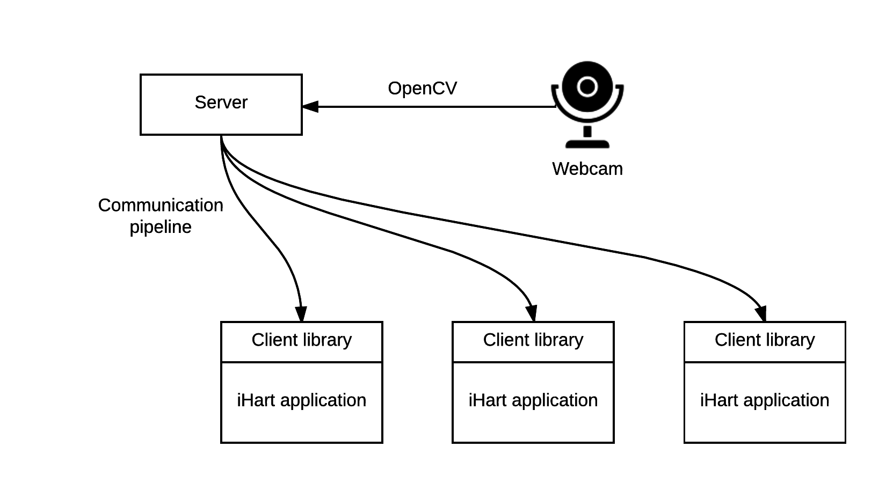

## Motivation

Interactive technology can help us create an engaging environment through which we can introduce computer science to the public in a fun and interesting way. Interactive exhibits have been successfully installed in a range of locations including museums, airports and schools for various purposes from amusement through information dispersal to community building.

The iHart project aims to go beyond creating interactive hallways that are fun and interesting to walk through. Its goals are to attract the attention of the students who pass by and to increase their interest in computer science and technology. The iHart project also provides inexperienced programmers with the opportunity to be able to create dynamic applications with rewarding graphics and functionality. Students who have only just started to learn more about computer science can easily get involved with the iHart project and see their work result in visually attractive and interesting public installation. At [Mount Holyoke College](https://www.mtholyoke.edu/ "Mount Holyoke College"), the main goal of the iHart project is to inspire women to pursue careers in computer science and technology and to provide them with a rewarding experience as they embark on their journey to become programmers, computers scientists and much more.

## Project Description

The iHart project uses a camera-projector system and the Adobe Flash application development environment to create an interactive system that can be easily installed into a hallway and an intuitive development environment that can be used to create new applications.

### Levels of Interaction
* **User**  
  Consumer with minimal tech comfort (e.g. a high school science teacher)  
  Usage of pre-compiled software  
  
* **Beginner Developer**  
  Undergraduate student with intro computer science class  
  Application development
  
* **Developer**  
  Undergraduate student majoring in CS  
  iHart software development

### Setup
There are three iHart setup variants:  

### Technical Workflow
  
The iHart system consists of two parts – a server and a client. The server uses OpenCV to monitor the camera feed for motion. The client triggers CVEvents based on the information it receives from the server. The iHart applications create an instance of the client and listen to the CVEvents, which they can respond to as they would  to a MouseEvent.

### Application Development
The iHart project hides all of the intricacies of computer vision and socket communication and allows students to develop iHart applications in the Adobe Flash environment which is very intuitive and easy to use. The iHart project creates an open source SDK that offers access to the latest computer vision technology by using the OpenCV library. Building on this underlining structure, iHart provides an API for the development of Flash applications. This API uses an event architecture which allows it to remain consistent with the traditional mouse and keyboard interaction, so that students can quickly learn how to use this new development environment.

### iHart Strengths
While commercial systems with similar functions do exist, their cost is prohibitive for widespread adoption of the technology. The iHart project requires only an **inexpensive web camera and a projector** to create an **interactive environment on any surface**. The result is an unobtrusive, but highly engaging experience for anyone walking through the hallway. Adobe Flash allows students to **quickly develop interactive applications**, achieving a polished final look **without requiring prior background in programming or computer science**.
