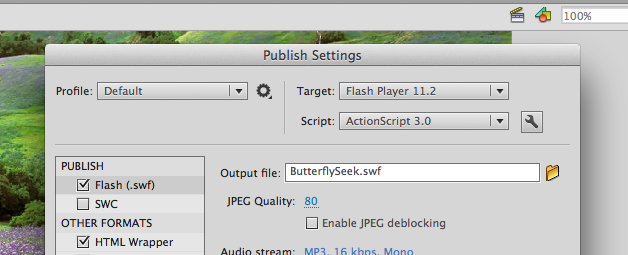
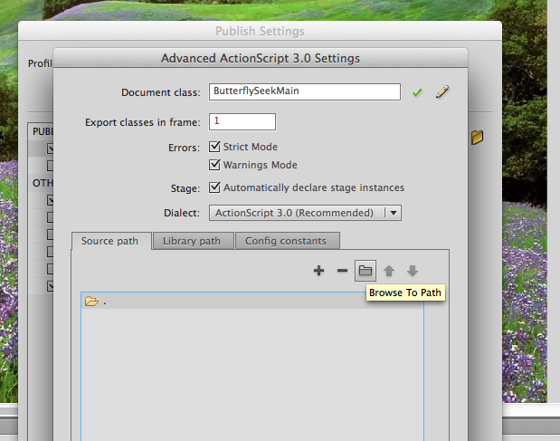
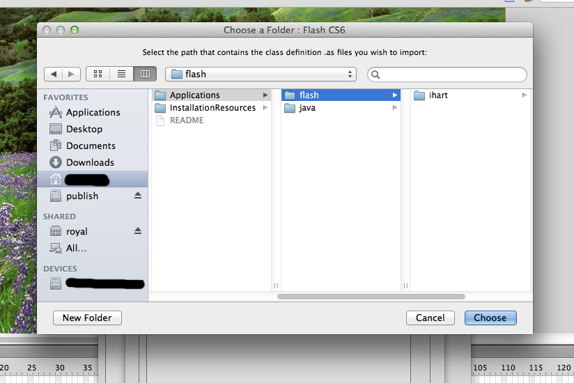
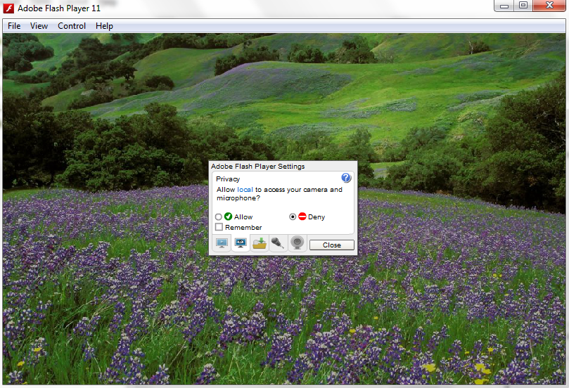
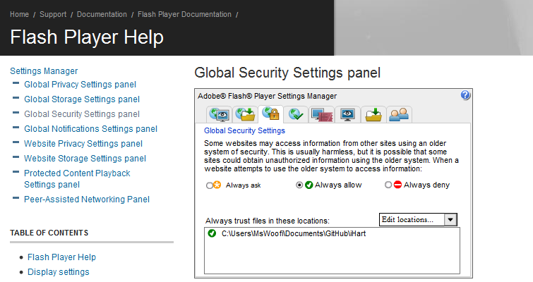

# Troubleshooting iHart applications

## Type was not found or was not a compile-time constant: CVEvent
This is caused by the fact that the application can\'t find the files containing the CVEvent class definitions.

To fix this, open the `.fla` file associated with the application, and go to **File -> Publish Settings**.
There will be a little **wrench-shaped icon** next to \"Script: ActionScript 3.0\". Click it.

This brings up a window of advanced settings. Click on **Source Path**, 
and then the **folder icon** that will let you \"Browse To Path\".

Browse to the **Applications -> flash** folder, and click **Choose** to add it as a source path.
Save and re-publish your application, and you shouldn\'t get the above error anymore.

## Local-with-filesystem SWF files are not permitted to use sockets
This is caused by Flash\'s security settings. There are two ways to fix this error; one for
Flash Player, and one for Adobe Flash CC.

### Flash Player
You can read more about this problem at the Adobe Flash Player Help website. 
To fix this issue open your Flash Player and right click into the middle of the
 window to bring up the **Flash Player Settings**.
 

Click on the image of the **question mark** in the upper right corner. 
You will be taken to a website with advanced settings.

On the Global Security Settings Panel choose 
**Edit locations -> Add location -> Browse for folder**, 
then specify the location of your iHart folder. Now your error should be fixed.

### Adobe Flash CC
Open the `.fla` file associated with the application, and go to **File -> Publish Settings**.

Under Publish, choose **Flash (.swf)** and scroll down to **Local Playback Security**,
and choose *Access network only** from the dropdown menu.

Save and re-publish your application, and you shouldn\'t get the above error anymore.

## The application just isn\'t working
Make sure to follow the instructions that can be found under the [software section](/software) 
on how to run iHart. Trying drawing different areas of interest, or changing the camera index.

If you\'re on a Mac or a machine running OSX, try republishing in the
 \"Mac projector\" or `.app` format.
 

## Other errors

More can be found [here](https://sites.google.com/a/mtholyoke.edu/the-care-and-keeping-of-ihart/developer-resources/troubleshooting)

They will be re-documented here later.