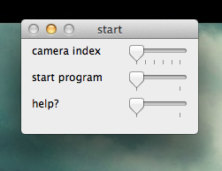
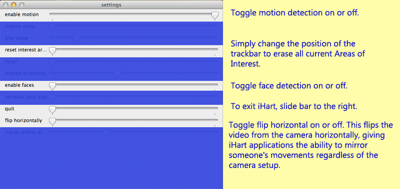
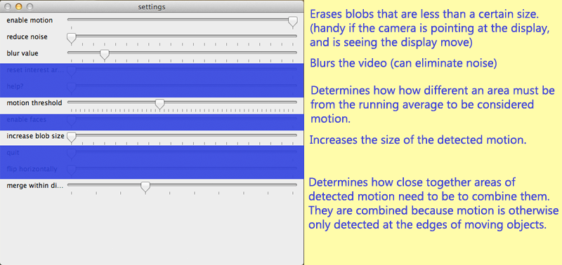

# How to use iHart

[Known issues](/software/issues)

[All existing server versions](https://github.com/ihart-mhc/ihart/releases) -- the latest release is the one with the highest number.

### Starting window 

When the program starts, it shows a starting screen that allows you to choose your camera.
 If the computer only has access to one camera (built-in or external), it\'ll be index 0.
  Otherwise, the possible indexes will be 0 through (Number of Cameras -1). 
  To start the rest of the program, just drag the start program slider to 1.
  
  

### Main program
When the program opens, the **controls window** will appear on top of two other windows. 
One shows the detected motion in black and white (white is motion), and the other shows the video feed. 
The **motion window** may also appear on top of the **video window**. 

One thing you will need to do is create an area of interest. 
This determines which part of the video feed you\'re interested in detecting motion and/or faces for, 
and no data will be sent to iHart applications until you create at least one. 
To do so, click on a starting point in the video window, and drag your mouse across the window until you are satisfied, then release the mouse button.
**Areas of interest appear in blue**. 
If the areas of interest aren\'t being created, try to make sure the area in front of the camera is still before creating the area.
If you don\'t like where you started from, you can just move your mouse back towards the starting point\--eventually
 the area of interest will turn orange and when you release the mouse, it won\'t be saved. 
You can also erase your areas of interest by reseting them in the control window (just change the position of the \"reset interest areas\" slider).

In addition to displaying the areas of interest and the video feed, 
the video window displays rectangles representing detected motion and detected faces. 
Each rectangle represents a single instance of each. **Motion appears in yellow**, while **faces appear in green**.
(The only change in controls from the previous image is that faces are now enabled; they are initially disabled.)

Once you\'ve created an area of interest and opened an iHart application, you\'re good to go! 
You can change the settings, but the application will respond to movement/faces right away
and you probably don\'t need to change many of the controls. 
When you do want to change various settings, drag the sliders in the controls window. 
You probably will use only a few of them on a regular basis.

### The controls window

#### Main controls

**Enable motion** allows iHart to detect and send information about motion. 

**Reset interest areas** clears all of the current areas of interest.

**Enable faces** allows iHart to detect and send information about detected faces.

**Quit** quits the program.

**Flip horizontally** flips the video feed from the camera. 

All of these controls function as toggles or buttons. 
Dragging the bar is essentially the same as pressing a button or checking/unchecking a box. 

#### Motion settings

Several achieve similar results to each other\--reduce noise, blur value, and motion threshold can all cut back on unwanted motion\--but they all affect slightly different things. 

**Reduce noise** is particularly useful for getting the motion detection to ignore small areas of motion on an iHart display.
 If, for instance, you have a screen of snowflakes that blow around when motion is detected, 
 you wouldn't want iHart to detect the falling snowflakes themselves.  

**Motion threshold is good for responding to difficult light situations**. 
The threshold determines how far a pixel must be from its running average value to count as motion. 
If you make it too low, you might need to also reduce noise.  

**Merge within distance** controls how far areas of motion must be from each other in order to be combined. 
You might want to change this if you want areas of motion that are distinct from each other, 
but aren\'t getting them (perhaps two people are playing a game where each controls one side of the display, 
but because of the setup they\'re standing relatively close to each other). 

Increasing **blur value** can reduce noise by blurring the video image more. 

Increase **blob size** will enlarge areas of detected motion, making them more likely to overlap each other.

## iHart Explained
iHart consists of two parts: the server and the client. 
 
The server uses opencv to monitor a camera feed for motion and faces (collectively called Blobs).
 It creates a server socket with a local address and a port number 5024, and accepts all incoming connections.
  These connections are from the client side--one connection per running iHart Application.
   The server creates a String representation of its data and sends it to all of its connections. 

The client creates a socket and connects to the server socket.
 When it receives a message, it parses the data and triggers a CVEvent if there are any Blobs in the AreaOfInterest it is monitoring. 

iHart Applications create an instance of the iHart Client and listen to CVEvents,
 which they can then respond to as they might to a MouseEvent!
  This makes it easy for students and other programmers begin creating iHart Applications, 
  because the structure is familiar and natural to them. 
  iHart hides all of the intricacies of computer vision and socket communication. 
